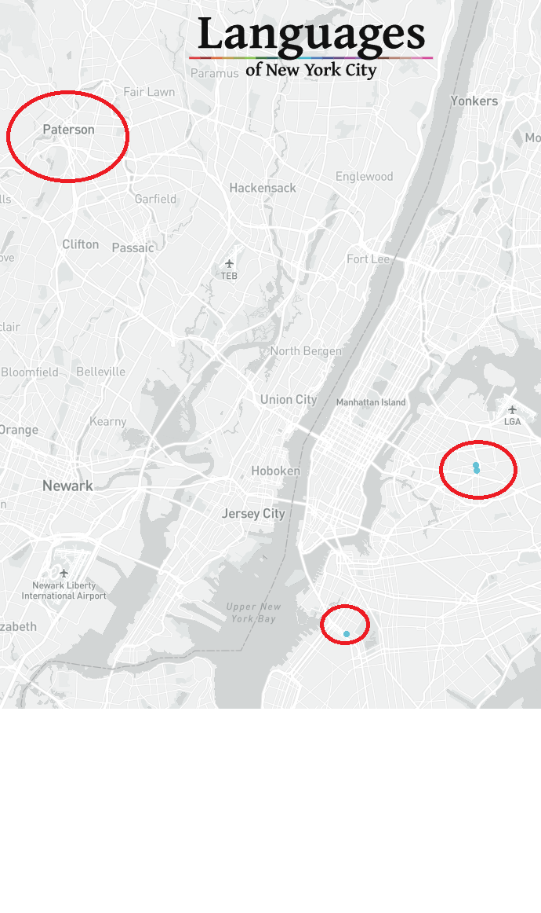

```{r}
#| label: setup
#| include: false
options(htmltools.dir.version = FALSE)
knitr::opts_chunk$set(
  fig.asp = 0.5625,
  out.width = "100%", 
  fig.retina = 2, 
  dpi = 300,
  echo = F,
  message = F, 
  warning = F
  )

set.seed(20250223)

# load libs 
library("tidyverse")
library("here")
library("knitr")
library("flextable")
library("rworldmap")
library("scales")
library("ds4ling")
library("ggtext")

theme_psllt <- function(...) {
  list(
    theme_bw(base_family = "Palatino", ...), 
    theme(
      plot.subtitle = element_text(color = "grey40"), 
      panel.grid.major = element_line(color = 'grey90', linewidth = 0.15),
      panel.grid.minor = element_line(color = 'grey90', linewidth = 0.15)
    )
  )
}

theme_set(theme_grey(base_size = 30))

```

```{r}
#| message: false
#| warning: false
#| include: false
### Incan Empire map ###
incan_empire <- data.frame(
  country = c("CUB","PRI","CRI","ECU","HND","NIC","PAN",
              "ARG","BOL","CHL","COL","DOM","SLV","GTM",
              "MEX","PRY","PER","URY","VEN"),
  inca = c("no","no","no","yes","no","no","no",
              "yes","yes","yes","yes","no","no","no",
              "no","no","yes","no","no")
)

incan_empire_map_object <- joinCountryData2Map(incan_empire, 
                                              joinCode = "ISO3", 
                                              nameJoinColumn = "country")

# numbers based on census data, Adeelar 1991, Adeelar 2000
# sourced from https://en.wikipedia.org/wiki/Quechuan_languages

### Quechua population map ###
quechua_pop <- data.frame(
  country = c("CUB","PRI","CRI",
              "ECU","HND","NIC","PAN",
              "ARG",
              "BOL",
              "CHL",
              "COL","DOM","SLV","GTM","MEX","PRY",
              "PER","URY","VEN"),
  quechua = c("no","no","no","yes","no","no","no",
              "yes","yes","yes","yes","no","no","no",
              "no","no","yes","no","no"),
  num_speakers = c(NA,NA,NA,
                   2300000,NA,NA,NA,
                   900000,
                   2100000,
                   9000,
                   10000,NA,NA,NA,NA,NA,
                   3800000,NA,NA)
)

#create map object
quechua_pop_map_object <- joinCountryData2Map(quechua_pop, 
                                              joinCode = "ISO3", 
                                              nameJoinColumn = "country")
```

# The Basics {.transition}

## What are we talking about today?

::: {.fragment .fade-up}
::: {.fragment .semi-fade-out}
History of Quechua-Spanish Contact [@escobar2011spanish]
:::
:::

::: {.fragment .fade-up}
::: {.fragment .semi-fade-out}
An overview of general contact phenomena [@escobar2011spanish]
:::
:::

::: {.fragment .fade-up}
::: {.fragment .semi-fade-out}
Contrastive focus in two Peruvian varieties [@o2012realization]
:::
:::

::: {.fragment .fade-up}
::: {.fragment .semi-fade-out}
Morphosyntactic contact-induced change in Spanish [@sanchez2004functional]
:::
:::

# History of Quechua-Spanish Contact {.transition}

##

:::: {.columns}

::: {.column width="50%"}

```{r}
mapCountryData(
  incan_empire_map_object,
  nameColumnToPlot = "inca",
  mapTitle = "Extension of Incan Empire",
  xlim = c(-80, -55),   # longitude
  ylim = c(-55, 20),     # latitude
  catMethod = "categorical",
  colourPalette = c("white","lightblue"),
  addLegend = FALSE
)

```

:::

::: {.column width="50%"}

```{r}
# visualize map
mapCountryData(
  quechua_pop_map_object,
  nameColumnToPlot = "num_speakers",
  mapTitle = "Number of Quechua speakers",
  xlim = c(-80, -55),   # longitude
  ylim = c(-55, 20)     # latitude
)

```

:::

::::

- [Incans]{.emph} conquered much of western South America from the [13th to 16th century]{.emph}
- [Quechua became lingua franca]{.emph}, in contact with many languages, among them [Aymara]{.emph}
- Incan elites spoke [extinct Puquina]{.emph} language

## Spanish Conquest in Western South America

```{r}

# ---- Quechua-Spanish Contact History ----
lingua_franca_df <- tribble(
  ~start_year, ~end_year, ~label, ~y_bottom, ~y_top,
  1438,        1650,      "Quechua lingua franca", 0.7, 0.75,
  1532,        1800,      "Minor Spanish–Quechua bilingualism", 0.62, 0.67,
  1800,        2009,      "Societal Spanish–Quechua bilingualism", 0.7, 0.75,
  1900, 2009, "Emergence of Andean Spanish", 0.62, 0.67
) %>%
  mutate(
    start_date = as.Date(paste0(start_year, "-01-01")),
    end_date   = as.Date(paste0(end_year, "-12-31"))
  )

# ---- Periods ----
periods_df <- tribble(
  ~period,               ~start_year, ~end_year, 
  "Incan Empire",        1438,        1533,
  "Spanish Conquest",    1532,        1572,
  "Colonial Period",       1572,        1820,
  "Modern Era",          1820,        2000
) %>%
  mutate(
    start_date = as.Date(paste0(start_year, "-01-01")),
    end_date   = as.Date(paste0(end_year, "-12-31"))
  )

# ---- Events (spots) ----
spots_df <- tribble(
  ~event,                  ~year,  ~description,
  "Spanish arrival",  1532,  "Spanish arrive in Incan Empire",
  "Urban walls",            1600,  "Walls around main Spanish cities",
  "Language policy change", 1650,  "Spanish king mandates hispanization",
  "Spanish control ends",   1820,  "Political/social control ends"
) %>%
  mutate(
    spot_date = as.Date(paste0(year, "-01-01")),
    # stagger y positions for segments
    label_y = c(1.25, 1.25, 1.25, 1.25),  # vertical position for label
    point_y = 1  # dot inside the bar
  )

# ---- Plot ----
ggplot() +
  # Lang history bar below main bars
  geom_rect(data = lingua_franca_df,
            aes(xmin = start_date, xmax = end_date,
                ymin = y_bottom, ymax = y_top),
            fill = "lightblue", alpha = 0.5) +
  geom_text(data = lingua_franca_df,
            aes(x = start_date + (end_date - start_date)/2,
                y = (y_bottom + y_top)/2, label = label),
            size = 3.5, fontface = "italic") +
  # Main period bars
  geom_rect(data = periods_df,
            aes(xmin = start_date, xmax = end_date,
                ymin = 0.8, ymax = 1.2,
                fill = period),
            color = "black", alpha = 0.5) +
  # Labels inside main bars
  geom_text(data = periods_df,
            aes(x = start_date + (end_date - start_date)/2,
                y = 1, label = period),
            color = "black", size = 4, fontface = "bold",
            angle = 45) +
  # Event points inside the bars
  geom_point(data = spots_df %>% filter(event != "Quechua lingua franca"),
             aes(x = spot_date, y = point_y),
             color = "red", size = 3) +
  # Segments connecting points to labels
  geom_segment(data = spots_df %>% filter(event != "Quechua lingua franca"),
               aes(x = spot_date, xend = spot_date,
                   y = point_y, yend = label_y),
               linetype = "dashed", color = "gray30") +
  # Event labels above the line
  geom_text(data = spots_df %>% filter(event != "Quechua lingua franca"),
            aes(x = spot_date, y = label_y, label = description),
            angle = 25, hjust = 0, size = 4) +
  # X-axis breaks
  scale_x_date(date_breaks = "50 years", date_labels = "%Y") +
  coord_cartesian(ylim = c(0.65, 1.6)) +
  labs(title = NULL,
       x = NULL, y = NULL) +
  theme_minimal() +
  ds4ling::ds4ling_bw_theme(base_size = 12) +
  theme(
    axis.text.x = element_text(angle = 45, hjust = 1),
    axis.text.y = element_blank(),
    axis.ticks.y = element_blank(),
    legend.position = "none",
    panel.grid.major = element_blank(), 
    panel.grid.minor = element_blank()
  )

```

::: notes
Quechua = official langues of Incas.
Incan aristocracy used Puquina, now extinct.
Prolonged & intense contact of Quechua, Puquina, and Aymara from 13th to 16th century.

During colonial period, Quehcua used as lingua franca.
Of the Spanish, merchants, administrators, and clergymen learned Quechua.
Of the Andeans, children of indigenous elite, clergymen, & escribanos (helpers) learned Spanish.

Walls constructed in early 17th century to separate Spaniards & indigenous -- very restricted contact.

Andean Spanish is 20th century phenomenon.
:::

## Modern Language Policies

```{r}
# ---- Modern language policy events ----
policy_events <- tribble(
  ~country,   ~year, ~policy,
  "Colombia", 1991,  "Spanish official; indigenous langs official regionally",
  "Peru",     1993,  "Right to use Spanish or indigenous languages in official gov't proceedings",
  "Chile",    1993,  "Chilean Indigenous Law: recognition of Amerindian languages",
  "Ecuador",  2008,  "Preservation of indigenous languages",
  "Bolivia",  2009,  "Spanish & all indigenous languages official",
  "Argentina", 2000, "No reference to indigenous languages"
) %>%
  mutate(event_date = as.Date(paste0(year, "-01-01")))

# ---- Plot ----
ggplot(policy_events, aes(x = event_date, y = country)) +
  geom_point(data = subset(policy_events, country != "Argentina"),
             color = "red", size = 4) +  
  geom_text(aes(label = str_wrap(policy, width = 40)),
            hjust = -0.05, vjust = 0.5, size = 4) +
  scale_x_date(
    date_breaks = "5 years",
    date_labels = "%Y",
    limits = as.Date(c("1990-01-01", "2015-12-31"))
  ) +
  scale_y_discrete(limits = rev(c("Colombia","Peru","Chile","Ecuador","Bolivia","Argentina"))) +
  labs(x = NULL, y = NULL) +
  ds4ling::ds4ling_bw_theme(base_size = 12) +
  theme(
    axis.text.y = element_text(face = "bold"),
    axis.text.x = element_text(angle = 45, hjust = 1),
    panel.grid.major = element_blank(), panel.grid.minor = element_blank()
  )
```

::: notes
Indigenous languages are being recognized across LA, but of course there's still a lot of stigma.
Despite the gov't language policies to support them, there is still a growing shift from Quechua to Spanish, especially as Quechua speakers move to urban centers.
:::

## Andean Spanish Outside of the Andes

:::: {.columns}

::: {.column width="50%"}

{ width=80% }

:::

::: {.column width="50%"}

- Large Quechua-speaking population in Queens & Brooklyn in NYC
- Large Quechua-speaking population in Patterson, NJ
  - Largest Peruvian percentage in the U.S. per capita!
  
:::
::::

::: footer
https://languagemap.nyc/

https://web.archive.org/web/20150201040607/http://www.utsandiego.com/news/2011/may/28/some-ny-immigrants-cite-lack-of-spanish-as-barrier/

@paerregaard2008peruvians
:::

::: notes
Quechua varieties are spoken in Brooklyn, Queens, and for some reason concentrated in Patterson, NJ.
:::

## Let's listen to two varieties

:::: {.columns}

::: {.column width="50%"}



:::

::: {.column width="50%"}



:::
::::

- Anything that catches your attention?

## {background-iframe="https://ich.unesco.org/doc/src/00120-EN.pdf" background-interactive=TRUE}

# General Contact Phonema {.transition}

## Andean Spanish

::: {.fragment}
- a [Spanish variety]{.emph} primarily spoken in the [Andean region]{.emph} of various countries spoken by...
:::

::: {.fragment}
    - monolingual speakers
    
:::

::: {.fragment}
    - 2L1 bilinguals 

:::

::: {.fragment}
    - L1 Quechua or L1 Aymara L2 Spanish speakers

:::

:::{.fragment}
- daily contact with [L2 Andean Spanish]{.emph} speakers
:::

:::{.fragment}
- contact with [non-Andean varieties]{.emph} of Spanish
:::

## Let's review some terminology...

- Van Coestem [-@coetsem2000general; -@van2016loan] proposes a psycholinguistic model for borrowing...

::: {.fragment}
In groups, define the following terms and be prepared to share a [specific contact example]{.emph}
:::

::: {.fragment}
- Source language
- Recipient language
- Agentivity
- Imposition
- Borrowing
:::

## The Lexicon

```{r}
data.frame(
  matrix(
    c(
      "huayco - mud slide",
      "palta - avocado",
      "ñano - male child",
      "cuy - guinea pig",
      "pisco - grape brandy",
      "zapallo - squash",
      
      "condor - condor",
      "caracha - skin infection",
      "quinua - quinoa",
      "tambo - small inn",
      "ojota - sandal",
      "choclo - corn",
      
      "pampa - plateau",
      "guagua - infant",
      "charqui - dried meat",
      "puna - high altitudes",
      "alpaca - alpaca",
      "carpa - tent",
      
      "canchita - popcorn",
      "soroche - altitude sickness",
      "pucho - cigarette butt",
      "papa - potato",
      "caucho - rubber",
      "concho - sediment",
      
      "quena - quena",
      "chancar - to flatten",
      "cancha - large outdoor space",
      "calato - naked",
      "puma - puma",
      "chakra - ranch"
    ),
    nrow = 5,
    ncol = 6,
    byrow = TRUE
  ),
  stringsAsFactors = FALSE
) %>%
  kable(col.names = NULL)

```

::: note
This comes from @escobar2011spanish
:::

## The Segmental Inventory of Cusco Quechua

```{r}
consonant_inventory <- data.frame(
  Category = c(
    "Nasal",
    "Stop/Affricate (plain)",
    "Stop/Affricate (aspirated)",
    "Stop/Affricate (ejective)",
    "Fricative",
    "Semivowel",
    "Liquid (lateral)",
    "Liquid (rhotic)"
  ),
  Bilabial = c(
    "m",
    "p",
    "pʰ",
    "pʼ",
    "",
    "",
    "",
    ""
  ),
  Alveolar = c(
    "n",
    "t",
    "tʰ",
    "tʼ",
    "s",
    "",
    "l",
    "ɾ"
  ),
  `Post-alv./Palatal` = c(
    "ɲ",
    "tʃ",
    "tʃʰ",
    "tʃʼ",
    "ʃ",
    "j",
    "ʎ",
    ""
  ),
  Velar = c(
    "",
    "k",
    "kʰ",
    "kʼ",
    "",
    "w",
    "",
    ""
  ),
  Uvular = c(
    "",
    "q",
    "qʰ",
    "qʼ",
    "",
    "",
    "",
    ""
  ),
  Glottal = c(
    "",
    "",
    "",
    "",
    "h",
    "",
    "",
    ""
  ),
  stringsAsFactors = FALSE
)

knitr::kable(consonant_inventory, align = "lcccccc")
```

::: note
Source: https://en.wikipedia.org/wiki/Cusco_Quechua
:::

## Typology

- Quechua is [agglutinative]{.emph}; Spanish is [fusional]{.emph}

- Quechua likes to add [suffixes]{.emph} to express meaning, sort of like Spanish, but there's usually a one-to-one correspondence of morpheme-to-meaning

:::: {.columns}

::: {.column width="50%"}
[Spanish]{.emph}  

<span style="color:#8c564b;">aún</span>
<span style="color:#1f77b4;">estoy</span>
<span style="color:#d62728;">com</span>
<span style="color:#1f77b4;">iendo</span>

:::

::: {.column width="50%"}
[Quechua]{.emph}  

<span style="color:#d62728;">mikhu</span>
<span style="color:#1f77b4;">chka</span>
<span style="color:#ffbf00;">ni</span>
<span style="color:#8c564b;">raq</span>
<span style="color:#17becf;">mi</span>
:::

::::

## Morphosyntactic Features

Present example sentences for conditional in protasis/apodosis of conditional sentences
Skip omission of third person object clitics.
Animate leísmo
Frequent use of diminutive on nouns, adj, gerunds, numerals, adverbs, pronouns. use for modesty, deferential courtesy.
redundant direct object clitics with nominal referent.
presence of possesssive determiner with genitive phrase.

## Typology

- Quechua is <span style="color:#8c564b;">s</span><span style="color:#1f77b4;">o</span><span style="color:#d62728;">v</span>; Spanish is <span style="color:#8c564b;">s</span><span style="color:#d62728;">o</span><span style="color:#1f77b4;">v</span>

:::: {.columns}

::: {.column width="50%"}
[Spanish]{.emph}  

<span style="color:#8c564b;">nosotros</span><span style="color:#d62728;">comemos</span><span style="color:#1f77b4;">carne</span>

:::

::: {.column width="50%"}
[Quechua]{.emph}  

<span style="color:#8c564b;">ñuqanchik</span><span style="color:#1f77b4;">aychata</span><span style="color:#d62728;">mikhunchik</span>
:::

::::

## Patterns of Use

<span style="color:#d62728;">Usqhaylla</span> <span style="color:#1f77b4;">phawarqayku</span>

<span style="color:#1f77b4;">We ran</span> <span style="color:#d62728;">quickly</span>

<span style="color:#d62728;">Kimsa horatam</span> <span style="color:#1f77b4;">mikunchik</span>

<span style="color:#1f77b4;">We eat</span> <span style="color:#d62728;">at three o'clock</span>

::: {.fragment}
- What might Andean Spanish speakers produce?
:::

## Patterns of Use

- According to [generativist/usage-based] theories, changes in patterns of use [is]{.emph} reflective of language change

::: {.fragment}
- What motivates the [generativist]{.emph} belief that patterns of usage [is not]{.emph} reflective of language change?
- What motivates the [usage-based]{.emph} belief that patterns of usage [is]{.emph} reflective of language change?
:::

# Focus in Contact {.transition}

## Pasto, Colombia



## Focus & Prosody/Intonation in Quechua

## Focus & Prosody/Intonation in Spanish

## Participants

## Data set

## Measurements

## Hypotheses

## Results

## Tonal peaks in contrastive vs broad focus

## Peak alignment in contrastive focus

## Comparison of focus strategies

# Morphosyntax in Contact {.transition}

## Thanks! {.final visibility="uncounted"}

{.absolute top="0" right="0" width="55" height="55"}


<table style="border-collapse: collapse; border: none;">

  <tr>
    <td style="text-align: right; padding-right: 10px;">
      <a href="https://www.jvcasillas.com/quarto-rutgers-theme/"></a>
    </td>
    <td>jvcasillas.com/quarto-rutgers-theme</td>
  </tr>
  
  <tr>
    <td style="text-align: right; padding-right: 10px;">
      <a href="mailto:rme70@scarletmail.rutgers.edu"></a>
    </td>
    <td>rme70@scarletmail.rutgers.edu</td>
  </tr>

  <tr>
    <td style="text-align: right; padding-right: 10px;">
      <a href="https://robertespo.github.io/"></a>
    </td>
    <td>robertespo.github.io</td>
  </tr>

  <tr>
    <td style="text-align: right; padding-right: 10px;">
      <a href="https://github.com/RobertEspo"></a>
    </td>
    <td>\@RobertEspo</td>
  </tr>
  
  <tr>
    <td style="text-align: right; padding-right: 10px;">
      <a href="mailto:ec1310@scarletmail.rutgers.edu"></a>
    </td>
    <td>ec1310@scarletmail.rutgers.edu</td>
  </tr>
  
  <tr>
    <td style="text-align: right; padding-right: 10px;">
      <a href="emcorregidor.github.io/"></a>
    </td>
    <td>emcorregidor.github.io/</td>
  </tr>
  
  <tr>
    <td style="text-align: right; padding-right: 10px;">
      <a href="https://github.com/emcorregidor"></a>
    </td>
    <td>\@emcorregidor</td>
  </tr>
  
</table>

## References {visibility="uncounted"}

::: {#refs .smaller}
:::